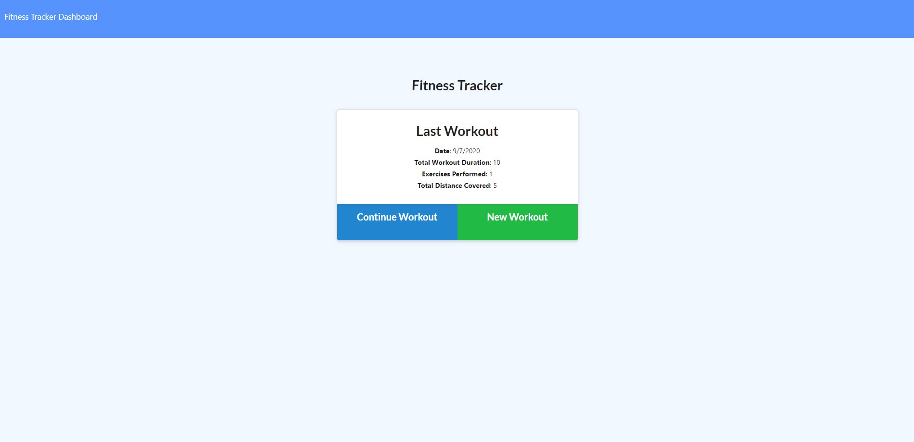

   
   
   
   
   
   
  

  # Welcome to Workout Tracker

  ## Table of Contents

  * [Description](#Description)
  * [Demonstration](#Demonstration)
  * [Setup](#Setup)
  * [Usage](#Usage)
  * [License](#License)
  * [Contributions](#Contributions)
  * [Version](#Version)
  * [Tests](#Tests)
  * [Questions](#Questions)

  ## Description

  An application to log and track your workouts and exercises to stay organized and motivated. The app demonstrates use of a NoSQL hosted database using Atlas MongoDB.

  ## Demonstration

  View a live demonstration [here](https://dry-lowlands-11752.herokuapp.com/).

  #### Screenshot

  

  ## Setup

  No installation required

  ## Usage

  Access the live application using the link provided above. Create a workout and add exercises to it using the intuitive user interface.

  ## License

  

  You may utilize this application under the terms of the [MIT license](assets/licences/MIT.txt).

  ## Contributions

  Users wanting to make changes may make a pull request. I will review and approve as necessary.

  ## Version

  

  ## Tests

  Not tests available.

  ## Questions

  If you have further questions or would like to see more features, please contact me via github or email:

  https://github.com/bdcoelho 

  https://github.com/bdcoelho/Workout-Tracker

  